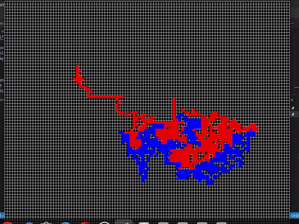

# Filler Game Visualization
This project is a Rust implementation of the game Filler, with a visualization using the `SDL2` library. The game involves placing pieces on a board to encircle the enemy.

## Features

- Read game state from standard input
- Visualize the game board using `SDL2`
- Determine the best coordinates to place pieces to attack the enemy

## Getting Started

### Prerequisites

- Rust (https://www.rust-lang.org/tools/install)
- `SDL2` crate (https://github.com/Rust-SDL2/rust-sdl2)
- Docker (https://www.docker.com/get-started)

### Installation

1. Clone the repository:
    ```sh
    git clone https://github.com/your-username/filler-game-visualization.git
    cd filler-game-visualization
    ```

2. Install dependencies:
    ```sh
    cargo build
    ```

### Usage

1. Run the project:
    ```sh
    cargo run
    ```

2. The game will read input from standard input. Provide the board and piece configurations as required by the game.

### Input Format

- **Board Configuration**:
    ```
    Anfield <height> <width>:
    <row1>
    <row2>
    ...
    <rowN>
    ```

- **Piece Configuration**:
    ```
    Piece <height> <width>:
    <row1>
    <row2>
    ...
    <rowN>
    ```

### Example Input

- Board:
    ```
    Anfield 15 17:
    ..o.....@.......
    ....o....@......
    ......o...@.....
    .....o......@...
    .......o........
    ........o.......
    .......o...@....
    ......o...@.....
    .....o......@...
    .......o........
    ........o.......
    .......o...@....
    ......o...@.....
    .....o......@...
    .......o........
    ```

- Piece:
    ```
    Piece 3 5:
    ..@..
    .@@@.
    .....
    ```

### Project Structure

- `src/main.rs`: Entry point of the application.
- `src/solver.rs`: Contains logic to determine the best coordinates to place pieces.
- `src/visualization.rs`: Contains the `MainState` struct and drawing logic.
- `src/read_buffer.rs`: Contains the `Player` struct and methods for reading game state.

### Functionality

- **`Player` struct**: Holds the player's identifier, board, and piece configurations.
- **`read_loop` function**: Reads the game state in a loop.
- **`get_coor` function**: Determines the best coordinates to place pieces.
- **`MainState` struct**: Handles the game state and drawing using `SDL2`.

### Algorithm

The core of the game logic is an algorithm designed to encircle the enemy on the board. The algorithm involves several key steps:

1. **Identify Possible Placements**: The algorithm first identifies all potential places where the current piece can be placed on the board without violating the game rules.

2. **Enemy Detection**: It then detects the position of the enemy on the board.

3. **Optimal Placement Calculation**: Using a distance-based approach, the algorithm calculates the optimal placement of the piece to minimize the distance to the enemy, thereby working towards encircling the enemy.

4. **Placement Validation**: The algorithm ensures that the placement does not overlap with invalid positions and adheres to the game rules.

This approach ensures that the pieces are strategically placed to encircle the enemy efficiently.

### Visualizing the Game

The game board is visualized using the `SDL2` library. Different colors are used to represent the players, the enemy, and empty spaces.
<br>
**curent player :** Blue color<br>
**Enemy :** Red color<br>

#### game engine [here](https://assets.01-edu.org/filler/filler.zip)
### Docker

You can also run this project inside a Docker container.

1. Build the Docker image:
    ```sh
    docker build -t filler .
    ```

2. Run the Docker container:
```sh
    docker run -it --rm filler
```


### Contribution
Contributions are welcome! Please fork the repository and create a pull request.
